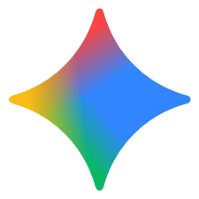
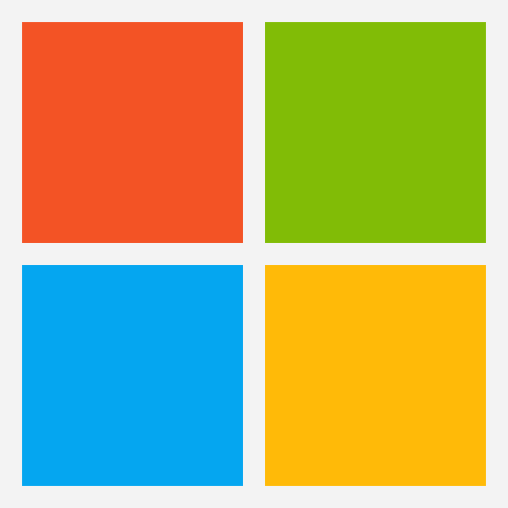

# Siwmae, I'm Gwern James 🏴󠁧󠁢󠁷󠁬󠁳󠁿

Welcome to my GitHub profile!  
I’m a self-motivated and approachable individual with experience as a Performance Analyst in rugby environments worldwide. I bring strong technical and soft skills, and I’m fluent in Welsh and English.

I’m now transitioning into software development, focusing on QA automation. Having relied on software throughout my career, I believe in building tools that are reliable, efficient, and user-friendly.
I’ve started my journey with Python, Selenium, and Playwright, and I’m excited to keep growing.

💡 I’d love to collaborate on projects in test automation, performance analytics, or sports technology — anything that pushes boundaries and makes workflows smarter

  

---

## 🛠️ Software & Languages I Use

  <!-- Python -->
  
  
  <!-- Selenium (white) -->
  
  
  <!-- Playwright -->
  
  
  <!-- VS Code -->
  
  
  <!-- PyCharm -->
  
  
  <!-- GitHub (light gray) -->
  
  
  <!-- ChatGPT (white) -->
  
  
  <!-- Gemini (colorful) -->
  
  
  <!-- Microsoft -->
  
  
  <!-- macOS (white) -->
  
  
  <!-- Hudl -->
  

